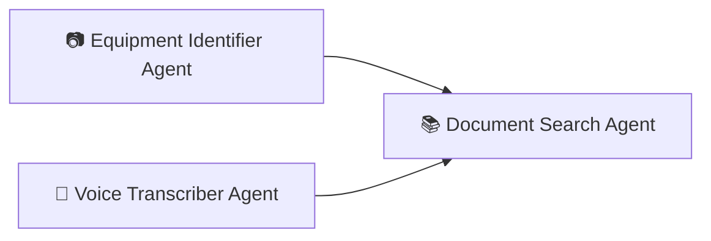

# 🌐 Aura - AI Supervisor for Enterprise Operations 

**Aura** is an AI-powered, multi-agent system designed to act as a **first responder** for high-stakes operational tasks.  
It orchestrates a team of specialized AI agents to diagnose problems, fetch official procedures, and guide technicians — turning minutes of chaos into seconds of controlled, auditable action.

---

## 🚀 How It Works



1. **Equipment Identifier Agent** → Recognizes equipment from images.
2. **Voice Transcriber Agent** → Converts spoken technician queries into text.
3. **Document Search Agent** → Searches operational manuals to provide structured, official solutions.

---

## 🛠 Tech Stack

- **CrewAI** → Multi-agent orchestration
- **Streamlit** → User interface
- **Groq API** → Equipment identification
- **Google Cloud Speech-to-Text API** → Voice transcription
- **Gemini LLM** → Agent reasoning and knowledge

---

## 📂 Project Structure

```
.
├── .env.example       # environmental variables
├── .gitignore
├── agent.py           # Defines AI agents (equipment identifier, transcriber, document searcher)
├── api.py             # API layer to orchestrate agent interactions and monitoring
├── app.py             # Streamlit frontend application
├── config.py          # Configuration, environment variables, and directory setup
├── crew.py            # CrewAI setup linking agents and tasks
├── output_handler.py  # Real-time output capture and monitoring
├── README.md          # Understand the repo structure
├── requirements.txt   # install the required dependencies
├── tasks.py           # Defines tasks for each agent
├── tools.py           # Tools for speech recognition, equipment ID, and document search
├── utils.py           # Utility functions for validation, logging, and session handling
├── requirements.txt   # Python dependencies
└── presentation/      # Demo video and presentation
```

---

## 📋 Prerequisites

1. **Google Speech-to-Text API key** (JSON credentials)
   - Create a project in [Google Cloud Console](https://console.cloud.google.com/), enable _Speech-to-Text API_, and download service account JSON.
2. **Groq API key** → Available from the [Groq developer portal](https://groq.com/).
3. **Gemini API key** → Available via [Google AI Studio](https://aistudio.google.com/).
4. **ffmpeg** → Required for `pydub` audio processing. Install via package manager (`sudo apt install ffmpeg` or `brew install ffmpeg`).
5. **GCC version > 9** (for dependencies like `pydub`, `crewai[tools]` etc that rely on system-level libraries).

---

## ⚡ Run Locally

```bash
# Clone repository
git clone https://github.com/snehadebnath26/SamsungHackathon.git
cd SamsungHackathon

# Create and activate virtual environment
python -m venv .venv
source .venv/bin/activate   # On Linux/Mac
.venv\Scripts\activate      # On Windows

# Install dependencies
pip install -r requirements.txt
pip install "crewai[tools]"

# Setup database
mkdir database
# Place all operational manuals in PDF format inside /database

# Store Google Speech-to-Text JSON credentials
# Example: gcp_key.json at project root

# Configure environment variables
cp .env.example .env
# Edit .env and add your GEMINI_API_KEY, GROQ_API_KEY, and GOOGLE_API_KEY

# Run the app
streamlit run app.py
```

---

## ✨ Future Improvements

- Add **real-time agent collaboration** (parallel execution instead of sequential).
- Integrate **incident logging & analytics** for compliance and audit.
- Extend support for **multilingual transcription & documentation search**.

---

## 🤝 Contributions

Contributions are welcome!  
Feel free to open issues, suggest improvements, or submit pull requests.

---

📂 **Note**:
Demo video and presentation are available in the **`presentation/`** folder.
